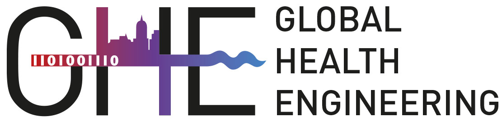

# Welcome to Global Health Engineering! 🌍

Our research focuses on the systems and technologies that can help improve all aspects of health in over-exploited countries and populations.

While the field of Global Health seeks to address the drivers and outcomes of well-being for international populations from a medical or epidemiological perspective, [Global Health Engineering](https://ghe.ethz.ch/) addresses determinants of health as a function of engineered interventions and systems. Our work looks at ways of reducing the negative impacts of modern life, particularly in urban areas of over-exploited countries. Our research seeks to reduce the negative impacts of improperly managed human, organic, and anthropogenic waste while ensuring that solutions are affordable, effective, and acceptable to users.

## Open Student Projects

If you are a student (Bachelors, Masters) and interested in working with us on a thesis or semester project, please send an email including:

- current CV, including language and country experience
- research interests including at least one well-defined research question
- the proposed timeline of your research project

Open positions for Bachelor and Master Thesis Projects are published on the SiROP platform. For a list of open opportunities, please see below. You can also apply directly through the platform including the details mentioned above.

The semester projects are most probably not listed below. If you are looking for one, don't hesitate to contact us:
- Dr. Jakub Tkaczuk: jtkaczuk@ethz.ch
- Prof. Elizabeth Tilley: tilleye@ethz.ch

Even if we did not list any open position for semester projects, we will find a topic for you!
